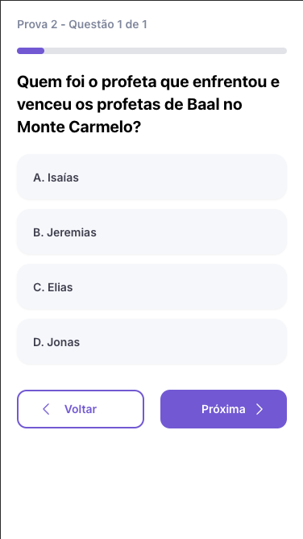

# Quiz App

Bem-vindo ao **Quiz App**!  
Este é um aplicativo de perguntas e respostas com temas bíblicos, desenvolvido com **Vue 3 + Firebase**, focado em aprendizado, diversão e crescimento espiritual.

Com uma interface moderna, responsiva e intuitiva, o Quiz App permite que os usuários participem de quizzes, acompanhem seu progresso e compartilhem conquistas com amigos.

## ✨ Funcionalidades Principais

- **Quizzes Bíblicos Interativos**: Responda perguntas sobre temas variados da Bíblia com diferentes níveis de dificuldade.
- **Pontuação e Ranking**: Veja seu desempenho e compare com outros participantes.
- **Resultados Salvos na Nuvem**: Todo o progresso é salvo via Firebase, disponível em qualquer dispositivo.
- **Design Responsivo**: Layout adaptável para celulares e desktops com uso de Tailwind CSS.

## 🧩 Em desenvolvimento

- **Sistema de Conquistas**
- **Compartilhamento de Resultados**
- **Modo Multiplayer ao Vivo**

## 📸 Capturas de Tela

<table>
  <tr>
    <td></td>
    <td></td>
    <td></td>
    <td></td>
  </tr>
</table>

*Figura 1: Tela inicial. Figura 2: Tela de quiz. Figura 3: Tela de ranking. Figura 4: Tela de resultados.*

## 🚀 Como Usar

1. **Instalação**  
   Clone o repositório e instale as dependências:

   ```sh
   npm install
   ```

2. **Configuração do Firebase**  
   Crie um arquivo `.env` com suas credenciais Firebase para conectar ao Firebase Auth e Firestore.

3. **Executar em modo desenvolvimento**

   ```sh
   npm run dev
   ```

4. **Build para produção**

   ```sh
   npm run build
   ```

## 🛠 Tecnologias Utilizadas

- **Vue 3 + Vite**
- **Firebase (Auth + Firestore)**
- **Tailwind CSS**
- **Pinia (State Management)**

## ⚙️ Requisitos do Sistema

- **Navegador**: Chrome, Firefox, Edge ou Safari atualizado
- **Conexão**: Necessária conexão com a internet

## 💡 Dicas para Desenvolvimento

Recomendamos os seguintes plugins no VS Code para melhor experiência:

- [Volar](https://marketplace.visualstudio.com/items?itemName=Vue.volar)
- [ESLint](https://marketplace.visualstudio.com/items?itemName=dbaeumer.vscode-eslint)
- [Tailwind CSS IntelliSense](https://marketplace.visualstudio.com/items?itemName=bradlc.vscode-tailwindcss)
- [Error Lens](https://marketplace.visualstudio.com/items?itemName=usernamehw.errorlens)

Adicione isso ao seu `settings.json`:

```json
"editor.codeActionsOnSave": {
  "source.fixAll.eslint": true
}
```

---

Agradecemos por utilizar o **Quiz App** para fortalecer seu conhecimento bíblico! Caso tenha dúvidas ou sugestões, fique à vontade para contribuir ou entrar em contato.

🙏 Boa jornada de aprendizado!